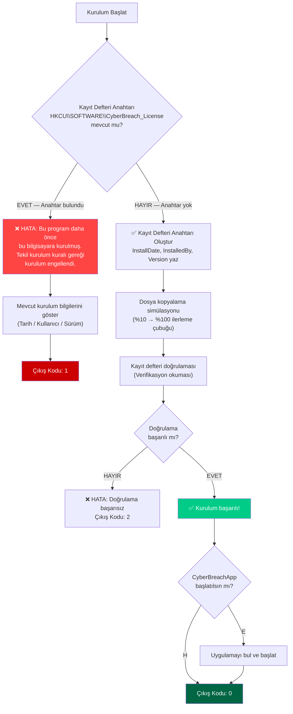
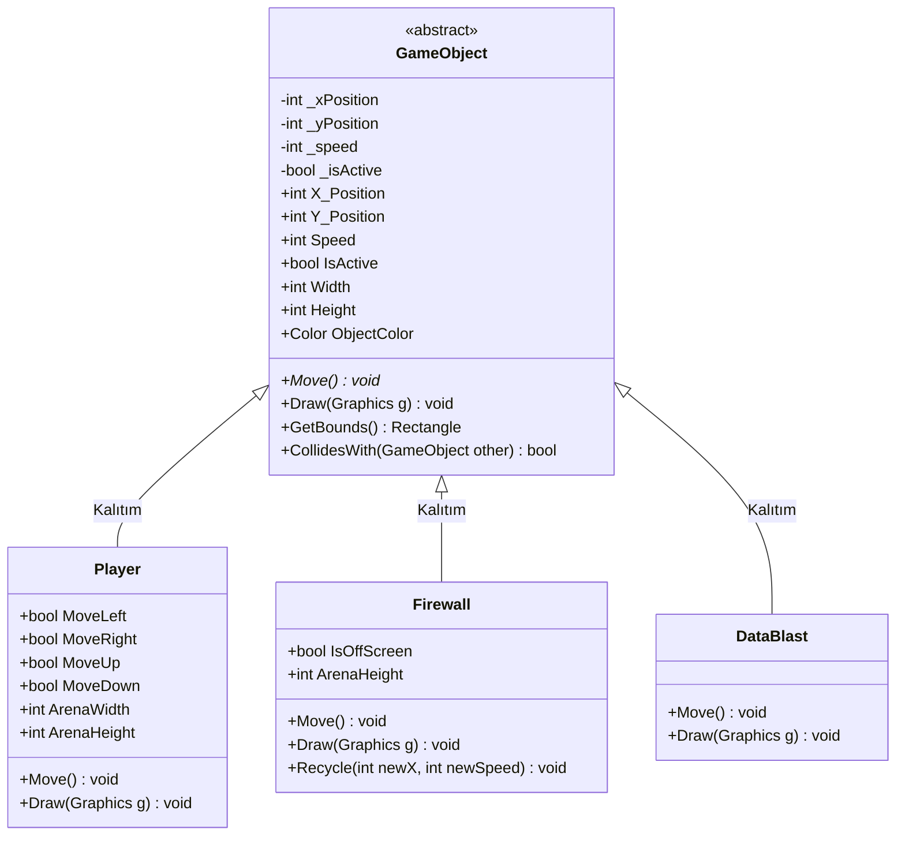

# CyberBreach — Proje Raporu

> **Proje Adı:** CyberBreach  
> **Geliştirme Ortamı:** C# / .NET — Windows Forms  
> **Teslim Tarihi:** 13 Nisan 2026  
> **Sürüm:** 1.0.0

---

## İçindekiler

1. [Proje Özeti](#1-proje-özeti)
2. [Çözüm Mimarisi](#2-çözüm-mimarisi)
3. [Nesne Yönelimli Programlama (OOP) Mimarisi](#3-nesne-yönelimli-programlama-oop-mimarisi)
   - 3.1 [Soyutlama (Abstraction)](#31-soyutlama-abstraction)
   - 3.2 [Kalıtım (Inheritance)](#32-kalıtım-inheritance)
   - 3.3 [Kapsülleme (Encapsulation)](#33-kapsülleme-encapsulation)
   - 3.4 [Çok Biçimlilik (Polymorphism)](#34-çok-biçimlilik-polymorphism)
4. [Tekil Kurulum Güvenlik Mekanizması](#4-tekil-kurulum-güvenlik-mekanizması)
   - 4.1 [Windows Kayıt Defteri Yapısı](#41-windows-kayıt-defteri-yapısı)
   - 4.2 [Çalışma Akış Diyagramı](#42-çalışma-akış-diyagramı)
   - 4.3 [Hata Kodları ve Hata Yönetimi](#43-hata-kodları-ve-hata-yönetimi)
   - 4.4 [Neden HKCU? — Güvenlik ve Yetki Analizi](#44-neden-hkcu--güvenlik-ve-yetki-analizi)
5. [Sınıf Hiyerarşisi ve UML Diyagramı](#5-sınıf-hiyerarşisi-ve-uml-diyagramı)
6. [Dosya Yapısı](#6-dosya-yapısı)
7. [Derleme ve Çalıştırma Talimatları](#7-derleme-ve-çalıştırma-talimatları)
8. [Oyun Kontrolleri](#8-oyun-kontrolleri)

---

## 1. Proje Özeti

**CyberBreach**, nesne yönelimli programlama (OOP) ilkelerinin uygulamalı olarak gösterilmesi amacıyla geliştirilmiş bir 2D oyun projesidir. Proje iki bağımsız bileşenden oluşmaktadır:

| Bileşen | Tür | Açıklama |
|---------|-----|----------|
| **CyberBreachApp** | Windows Forms Uygulaması | Oyuncu (`DataPacket`) düşen engelleri (`Firewall`) yukarı ateşleyerek yok eder veya onlardan kaçar. |
| **CyberBreachInstaller** | Konsol Uygulaması | Windows Kayıt Defteri üzerinden tekil kurulum kısıtlaması uygulayan kurulum sihirbazı. |

---

## 2. Çözüm Mimarisi

```
CyberBreachApp/
├── Final_Delivery/              ← Dağıtım paketi (bu klasör)
│   ├── CyberBreachApp/          ← Derlenmiş oyun dosyaları
│   │   ├── CyberBreachApp.exe
│   │   ├── CyberBreachApp.dll
│   │   └── ...
│   ├── CyberBreachInstaller/    ← Derlenmiş kurulum dosyaları
│   │   ├── CyberBreachInstaller.exe
│   │   ├── CyberBreachInstaller.dll
│   │   └── ...
│   └── README.md                ← Bu doküman
├── GameObject.cs                ← Soyut temel sınıf
├── Player.cs                    ← Oyuncu sınıfı (DataPacket)
├── Firewall.cs                  ← Düşman sınıfı (Güvenlik Duvarı)
├── DataBlast.cs                 ← Mermi sınıfı (Veri Patlaması)
├── Form1.cs                     ← Oyun döngüsü ve arayüz
└── CyberBreachInstaller/
    └── Program.cs               ← Kayıt defteri tabanlı kurulum mantığı
```

---

## 3. Nesne Yönelimli Programlama (OOP) Mimarisi

CyberBreachApp projesi, dört temel OOP ilkesini bilinçli ve yapısal olarak uygulamaktadır. Bu bölümde her ilke, ilgili kaynak kod referanslarıyla birlikte teknik düzeyde açıklanmaktadır.

### 3.1 Soyutlama (Abstraction)

**Tanım:** Soyutlama, bir nesnenin karmaşık iç detaylarını gizleyerek yalnızca dış arayüzünü sunma ilkesidir.

**Uygulama:** `GameObject` sınıfı `abstract` anahtar sözcüğü ile tanımlanmıştır. Bu sınıftan doğrudan nesne oluşturulamaz; yalnızca alt sınıflar üzerinden somutlaştırılabilir.

```csharp
public abstract class GameObject
{
    // Soyut yöntem — alt sınıflar tarafından mutlaka uygulanmalıdır
    public abstract void Move();

    // Sanal yöntem — isteğe bağlı olarak geçersiz kılınabilir
    public virtual void Draw(Graphics g) { ... }
}
```

**Tasarım Kararı:** `Move()` metodu soyut (`abstract`) olarak tanımlanmıştır çünkü her oyun nesnesi farklı bir hareket mantığına sahiptir. `Draw()` metodu ise sanal (`virtual`) olarak tanımlanmıştır; varsayılan bir dikdörtgen çizimi sağlar ancak alt sınıflar bunu geçersiz kılarak özel görsel sunumlar yapabilir.

---

### 3.2 Kalıtım (Inheritance)

**Tanım:** Kalıtım, bir sınıfın başka bir sınıfın özellik ve davranışlarını miras alarak kod tekrarını önleme mekanizmasıdır.

**Uygulama:** Üç somut sınıf, `GameObject` soyut temel sınıfından türetilmiştir:

```
GameObject (abstract)
├── Player    : GameObject   → Oyuncu (DataPacket)
├── Firewall  : GameObject   → Düşman (Güvenlik Duvarı)
└── DataBlast : GameObject   → Mermi (Veri Patlaması)
```

Tüm alt sınıflar, temel sınıftan aşağıdaki üyeleri miras alır:

| Miras Alınan Üye | Tür | Açıklama |
|-------------------|-----|----------|
| `X_Position`, `Y_Position` | Özellik | Konum bilgisi |
| `Speed` | Özellik | Hareket hızı (negatif değer koruması ile) |
| `Width`, `Height` | Özellik | Boyut bilgisi |
| `IsActive` | Özellik | Yaşam döngüsü durumu |
| `GetBounds()` | Metot | Çarpışma dikdörtgeni hesaplama |
| `CollidesWith()` | Metot | AABB çarpışma testi |
| `Draw()` | Sanal Metot | Grafik çizimi |

**Somut örnek:**
```csharp
public class Player : GameObject
{
    public Player(int x, int y, int speed, int arenaWidth, int arenaHeight)
        : base(x, y, speed, width: 40, height: 40, Color.FromArgb(0, 255, 200))
    {
        // Temel sınıf yapıcısı çağrılarak tüm ortak özellikler atanır
    }
}
```

---

### 3.3 Kapsülleme (Encapsulation)

**Tanım:** Kapsülleme, verilerin doğrudan erişimden korunarak kontrollü erişim sağlanması ilkesidir.

**Uygulama:** `GameObject` sınıfındaki kritik veriler `private` alan (field) + `public` özellik (property) deseni ile korunmaktadır:

```csharp
// Özel alan — doğrudan erişilemez
private int _speed;

// Kontrollü erişim — negatif değer atamasını engeller
public int Speed
{
    get => _speed;
    set
    {
        if (value < 0)
            throw new ArgumentOutOfRangeException(
                nameof(Speed), "Speed cannot be negative.");
        _speed = value;
    }
}
```

Kapsüllenen alanların tam listesi:

| Özel Alan | Genel Özellik | Doğrulama |
|-----------|---------------|-----------|
| `_xPosition` | `X_Position` | — |
| `_yPosition` | `Y_Position` | — |
| `_speed` | `Speed` | `value >= 0` zorunlu |
| `_isActive` | `IsActive` | Varsayılan: `true` |

Bu desen, sınıf dışından rastgele bir negatif hız değeri atanmasını engeller ve nesnenin iç tutarlılığını korur.

---

### 3.4 Çok Biçimlilik (Polymorphism)

**Tanım:** Çok biçimlilik, aynı arayüz üzerinden farklı davranışların sergilenmesi ilkesidir. Tek bir metot çağrısı, nesnenin gerçek türüne bağlı olarak farklı işlemler gerçekleştirir.

**Uygulama — Soyut Metot Geçersiz Kılma (Override):**

Her alt sınıf, `Move()` metodunu kendi hareket mantığına göre geçersiz kılar:

```csharp
// Player → 8 yönlü hareket, çapraz hız normalizasyonu
public override void Move()
{
    int dx = 0, dy = 0;
    if (MoveLeft) dx -= 1;
    if (MoveRight) dx += 1;
    if (MoveUp) dy -= 1;
    if (MoveDown) dy += 1;

    bool isDiagonal = dx != 0 && dy != 0;
    double effectiveSpeed = isDiagonal ? Speed * 0.7071 : Speed;
    // 0.7071 = 1/√2 → çapraz hareketin toplam hızını normalize eder
}

// Firewall → yalnızca dikey düşüş
public override void Move()
{
    Y_Position += Speed;
    if (Y_Position > ArenaHeight)
        IsOffScreen = true;
}

// DataBlast → yalnızca dikey yükseliş
public override void Move()
{
    Y_Position -= Speed;
    if (Y_Position + Height < 0)
        IsActive = false;
}
```

**Uygulama — Çok Biçimli Koleksiyon:**

Oyun döngüsünde tüm nesneler tek bir `List<GameObject>` koleksiyonunda tutulur. `Move()` ve `Draw()` çağrıları, her nesnenin gerçek türündeki uygulamayı çalıştırır:

```csharp
// Oyun döngüsü — tekil koleksiyon, çok biçimli çağrı
private List<GameObject> _gameObjects = new();

foreach (var obj in _gameObjects)
{
    if (obj.IsActive)
        obj.Move();  // Player, Firewall veya DataBlast — her biri kendi Move()'unu çalıştırır
}

foreach (var obj in _gameObjects)
{
    if (obj.IsActive)
        obj.Draw(g); // Her nesne kendi görsel sunumunu çizer
}
```

Bu yapı sayesinde oyuna yeni nesne türleri eklemek (örneğin `PowerUp`, `Boss`) mevcut oyun döngüsünde hiçbir değişiklik gerektirmez — yalnızca `GameObject`'ten türetilen yeni bir sınıf oluşturulması yeterlidir. Bu, **Açık-Kapalı İlkesini (Open/Closed Principle)** doğal olarak karşılar.

---

## 4. Tekil Kurulum Güvenlik Mekanizması

`CyberBreachInstaller`, Windows Kayıt Defteri (Registry) kullanarak her bilgisayarda yalnızca bir kez kurulum yapılmasını garanti eden bir güvenlik mekanizması uygular.

### 4.1 Windows Kayıt Defteri Yapısı

Kurulum gerçekleştiğinde aşağıdaki kayıt defteri girişi oluşturulur:

```
Kök Anahtar : HKEY_CURRENT_USER
Alt Anahtar  : SOFTWARE\CyberBreach_License
```

| Değer Adı | Tür | Örnek | Açıklama |
|-----------|-----|-------|----------|
| `InstallDate` | `REG_SZ` | `2026-04-13 23:07:21` | Kurulumun yapıldığı tarih ve saat |
| `InstalledBy` | `REG_SZ` | `Berke` | Kurulumu gerçekleştiren Windows kullanıcı adı |
| `Version` | `REG_SZ` | `1.0.0` | Yüklenen uygulama sürümü |

**Kalıcılık:** `Registry.CurrentUser.CreateSubKey()` ile oluşturulan anahtar, işletim sistemi seviyesinde saklanır. Uygulama kapandıktan, bilgisayar yeniden başlatıldıktan veya kurulum dosyası silindikten sonra bile kayıt defteri girişi **kalıcı olarak** yerinde kalır.

### 4.2 Çalışma Akış Diyagramı

Aşağıdaki akış diyagramı, kurulum sihirbazının karar mekanizmasını göstermektedir:



### 4.3 Hata Kodları ve Hata Yönetimi

Kurulum sihirbazı, `Main()` metodunun dönüş değeri üzerinden yapısal hata kodları döndürmektedir:

| Çıkış Kodu | Anlam | Tetiklenme Koşulu |
|:-:|--------|-------------------|
| `0` | ✅ Başarılı | Kurulum tamamlandı, kayıt defteri doğrulandı |
| `1` | ❌ Tekrarlanan Kurulum | `HKCU\SOFTWARE\CyberBreach_License` anahtarı zaten mevcut |
| `2` | ❌ Doğrulama Hatası | Kayıt defterine yazıldı ancak geri okuma doğrulaması başarısız |
| `3` | ❌ Yetki Hatası | `UnauthorizedAccessException` — kayıt defteri yazma izni yok |
| `99` | ❌ Beklenmeyen Hata | Diğer tüm istisnalar için genel hata kodu |

**Hata yönetimi yapısı:**

```csharp
try
{
    // Kayıt defteri işlemleri
}
catch (UnauthorizedAccessException ex)
{
    // Yetki hatası — kullanıcıya yönetici olarak çalıştırma önerilir
    return 3;
}
catch (Exception ex)
{
    // Genel istisna yakalama — uygulama kararlılığını korur
    return 99;
}
```

### 4.4 Neden HKCU? — Güvenlik ve Yetki Analizi

Windows Kayıt Defteri'nde iki ana kök anahtar bulunmaktadır:

| Kök Anahtar | Kapsam | Yönetici Yetkisi Gerekir mi? |
|-------------|--------|:---:|
| `HKEY_LOCAL_MACHINE` (HKLM) | Tüm kullanıcılar | ✅ Evet |
| `HKEY_CURRENT_USER` (HKCU) | Yalnızca mevcut kullanıcı | ❌ Hayır |

**`HKCU` tercih edilme gerekçeleri:**

1. **Yetki Bağımsızlığı:** `HKCU` altındaki anahtarlar, uygulama yönetici (`Administrator`) ayrıcalıkları olmadan okunabilir ve yazılabilir. Bu, UAC (`User Account Control`) isteminin tetiklenmesini önler ve kullanıcı deneyimini kesintisiz tutar.

2. **Kalıcılık:** `HKCU` anahtarları kullanıcının profil verisi (`NTUSER.DAT`) içinde saklanır. Uygulama silinse dahi anahtar sistemde kalır — bu da tekil kurulum kısıtlamasının kalıcılığını garanti eder.

3. **Güvenlik İzolasyonu:** Her Windows kullanıcısının kendi `HKCU` ağacı bulunur. Bu, bir kullanıcının kurulumunun diğer kullanıcıları etkilememesini sağlar ve çok kullanıcılı sistemlerde veri izolasyonunu korur.

4. **Tersine Mühendislik Direnci:** Kayıt defteri girişi, basit dosya tabanlı bayrak mekanizmalarına kıyasla keşfedilmesi ve kaldırılması daha zor bir konumdadır. Ancak `regedit.exe` ile erişilebilir olduğu için bu bir mutlak güvenlik değil, caydırıcı bir önlem olarak değerlendirilmelidir.

---

## 5. Sınıf Hiyerarşisi ve UML Diyagramı



---

## 6. Dosya Yapısı

### CyberBreachApp — Kaynak Dosyalar

| Dosya | Sorumluluk | OOP İlkesi |
|-------|-----------|-------------|
| `GameObject.cs` | Soyut temel sınıf; konum, hız, çarpışma mantığı | Soyutlama, Kapsülleme |
| `Player.cs` | 8 yönlü hareket, çapraz normalizasyon, elmas çizimi | Kalıtım, Çok Biçimlilik |
| `Firewall.cs` | Dikey düşüş, geri dönüşüm, tuğla duvar çizimi | Kalıtım, Çok Biçimlilik |
| `DataBlast.cs` | Dikey yükseliş, lazer çizimi, yaşam döngüsü | Kalıtım, Çok Biçimlilik |
| `Form1.cs` | Oyun döngüsü (~60 FPS), çok biçimli koleksiyon, çarpışma | Çok Biçimlilik |
| `Form1.Designer.cs` | Windows Forms tasarımcı kodu | — |

### CyberBreachInstaller — Kaynak Dosyalar

| Dosya | Sorumluluk |
|-------|-----------|
| `Program.cs` | Kayıt defteri tabanlı tekil kurulum, hata yönetimi, ilerleme simülasyonu |

---

## 7. Derleme ve Çalıştırma Talimatları

### Ön Gereksinimler

- .NET SDK 8.0 veya üzeri
- Windows 10/11 işletim sistemi

### Derlenmiş Sürümü Çalıştırma (Önerilen)

```powershell
# 1. Önce kurulum sihirbazını çalıştırın
cd Final_Delivery\CyberBreachInstaller
.\CyberBreachInstaller.exe

# 2. Ardından oyunu başlatın
cd ..\CyberBreachApp
.\CyberBreachApp.exe
```

### Kaynak Koddan Derleme

```powershell
# Release modunda derleme
dotnet publish -c Release -o Final_Publish --self-contained false

# Kurulum sihirbazı
cd CyberBreachInstaller
dotnet publish -c Release -o Final_Publish --self-contained false
```

### Kayıt Defteri Girişini Sıfırlama (Test Amaçlı)

Tekil kurulum kısıtlamasını sıfırlamak için aşağıdaki komut kullanılabilir:

```powershell
# PowerShell (yönetici yetkisi gerektirmez)
Remove-Item -Path "HKCU:\SOFTWARE\CyberBreach_License" -Recurse -Force
```

Veya `regedit.exe` uygulaması ile `HKEY_CURRENT_USER\SOFTWARE\CyberBreach_License` anahtarı manuel olarak silinebilir.

---

## 8. Oyun Kontrolleri

| Tuş | İşlev |
|:---:|-------|
| `W` / `↑` | Yukarı hareket |
| `A` / `←` | Sola hareket |
| `S` / `↓` | Aşağı hareket |
| `D` / `→` | Sağa hareket |
| `Boşluk` | DataBlast ateşle |
| `R` | Oyun bittiğinde yeniden başlat |

**Puan Sistemi:**

| Olay | Kazanılan Puan |
|------|:-:|
| Firewall ekranın altından geçti | +10 |
| Firewall DataBlast ile yok edildi | +25 |
| Firewall ile çarpışma | 💥 Oyun Sonu |

**Not:** Oyun ilerledikçe Firewall düşme hızları dinamik olarak artar, zorluk seviyesi puana bağlı olarak yükselir.

---

> **© 2026 — CyberBreach Projesi**  
> Bu doküman, proje teslimi kapsamında hazırlanmış akademik bir teknik rapordur.
